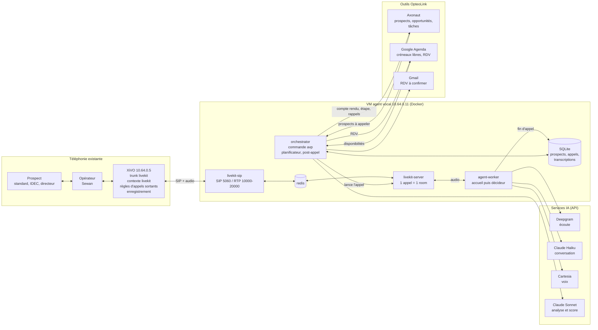

# Agent vocal de prospection — OpteoLink

Un agent vocal IA qui **passe lui-même des appels de prospection B2B** depuis le XiVO d'OpteoLink :

1. il franchit le standard ;
2. il qualifie le décideur ;
3. il prend un rendez-vous, transfère l'appel à Jean-Baptiste ou note un rappel ;
4. il remplit Axonaut.

Le transport audio et l'orchestration sont **auto-hébergés et open source** (LiveKit). Seules les briques d'IA sont appelées en API : Deepgram pour l'écoute, Claude pour le raisonnement, Cartesia pour la voix.



Tous les schémas (déroulé d'un appel, conversation, après l'appel, réseau) : [`docs/schemas.md`](docs/schemas.md).

## Comment ça marche, en 30 secondes

- Le démon `avp run` choisit les prospects à appeler (import Axonaut), **dans les plages horaires**, hors jours fériés et hors liste d'opposition.
- Pour chaque appel, il réveille le **worker** LiveKit, qui fait sonner le prospect via le **trunk SIP statique** du XiVO.
- Une détection de répondeur écarte les messageries. Si un humain décroche, l'agent **annonce qu'il est une IA et que l'appel est enregistré**, puis :
  - l'**agent accueil** passe le standard ;
  - l'**agent décideur** qualifie, traite les objections et propose des créneaux libres de ton agenda Google (mardi et jeudi en direct, lundi et vendredi sous réserve de ta confirmation par email).
- En fin d'appel, la transcription est enregistrée. **Claude Sonnet** l'analyse (score chaud, tiède ou froid, objections, prochaine action), puis **Axonaut** est mis à jour : événement, étape d'opportunité, tâches de rappel et relances d'échéance (fin de contrat dans un ou deux ans). Le RDV est posé dans **Google Agenda**, qui envoie l'invitation au client.
- Chaque lundi, un **rapport** compare les versions de prompts et propose des améliorations de script.

Le comportement commercial vit dans des **fichiers texte** : `prompts/*.md` et `campaigns/*.yaml`. On les modifie sans toucher au code.

## Par où commencer

| Je veux… | Lire |
|---|---|
| Comprendre l'architecture | [`docs/schemas.md`](docs/schemas.md), puis [`docs/architecture.md`](docs/architecture.md) |
| **Installer pas à pas** | [`MARCHE_A_SUIVRE.md`](MARCHE_A_SUIVRE.md) |
| Détails d'installation et dépannage réseau | [`docs/installation.md`](docs/installation.md) |
| Configurer le XiVO | [`xivo/README.md`](xivo/README.md), [`docs/xivo-trunk.md`](docs/xivo-trunk.md) |
| Modifier le script, créer une campagne | [`docs/prompts.md`](docs/prompts.md) |
| Préparer Axonaut | [`docs/axonaut.md`](docs/axonaut.md) |
| Brancher Google Agenda (RDV, confirmations) | [`docs/google-agenda.md`](docs/google-agenda.md) |
| Utiliser au quotidien | [`docs/exploitation.md`](docs/exploitation.md) |
| Déboguer, faire évoluer le code | [`docs/developpement.md`](docs/developpement.md) |
| Rester dans les clous | [`docs/cadre-legal.md`](docs/cadre-legal.md) |
| Tester chaque phase | [`docs/protocoles/`](docs/protocoles/) et [`docs/journal-tests.md`](docs/journal-tests.md) |

## Commandes principales

```bash
avp check                                              # tout est-il bien configuré ?
avp call test --number +336XXXXXXXX --campaign echo    # appel de test technique
avp call test --number +336XXXXXXXX --campaign ehpad   # appel de test avec le vrai script
avp prompt show ehpad --role decideur                  # ce que Claude lit pendant l'appel
avp campaign import ehpad --axonaut --pipe "EHPAD 2026" --step "À contacter"
avp campaign stats ehpad
avp calls list --last 20 ; avp calls show <call_id>
avp optout add 0562000000 --reason "demande téléphonique"
avp report weekly
```

## Arborescence

```
deploy/      docker-compose, Dockerfile, gabarits LiveKit/SIP/pare-feu, install.sh, healthcheck.sh
xivo/        trunk et dialplan XiVO (chan_sip et PJSIP), enregistrement, transfert
campaigns/   une campagne = un YAML (ehpad, cabinets-medicaux, echo)
prompts/     base, accueil, decideur, repondeur, analyse post-appel
src/avp/     code Python (voir docs/developpement.md § 1)
tests/       tests unitaires (pytest), sans réseau
docs/        documentation et protocoles de test
data/        base SQLite, transcriptions, rapports (non versionné)
```

## Développement

```bash
python3.12 -m venv .venv && . .venv/bin/activate
pip install -e ".[dev,agent]"
pytest -q && ruff check src tests
AVP_CONSOLE_CAMPAIGN=ehpad python -m avp.agent.worker console   # parler à l'agent au micro
```

Les conventions du projet sont dans `CLAUDE.md`.

## Coûts indicatifs

Environ **15 à 40 € par mois** pour 100 appels de 3 minutes (transcription, Claude, voix), plus la VM. Le détail et les tarifs sont dans `docs/exploitation.md` § 10.
