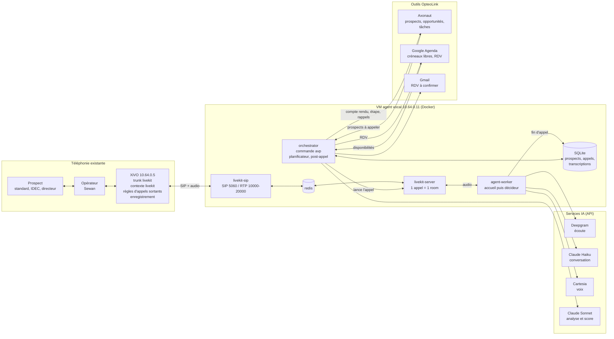
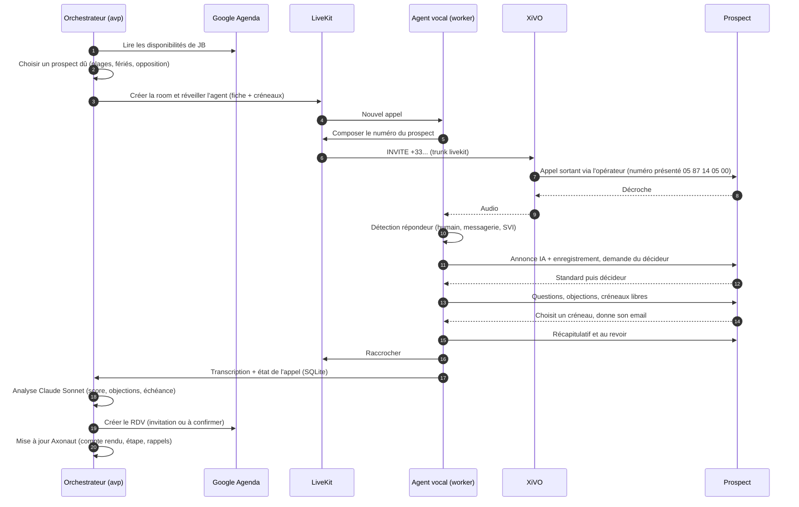
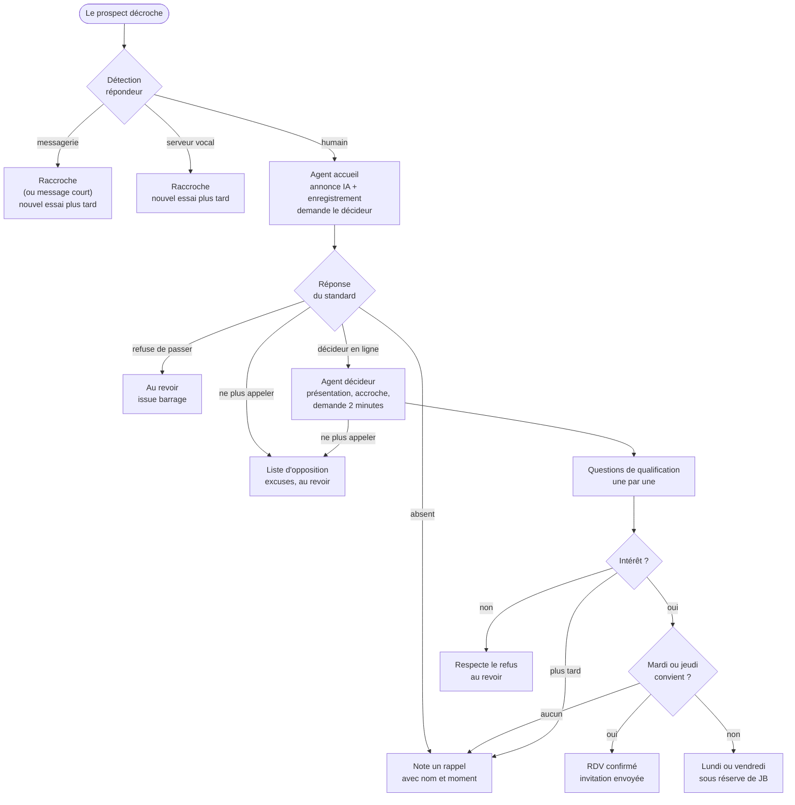
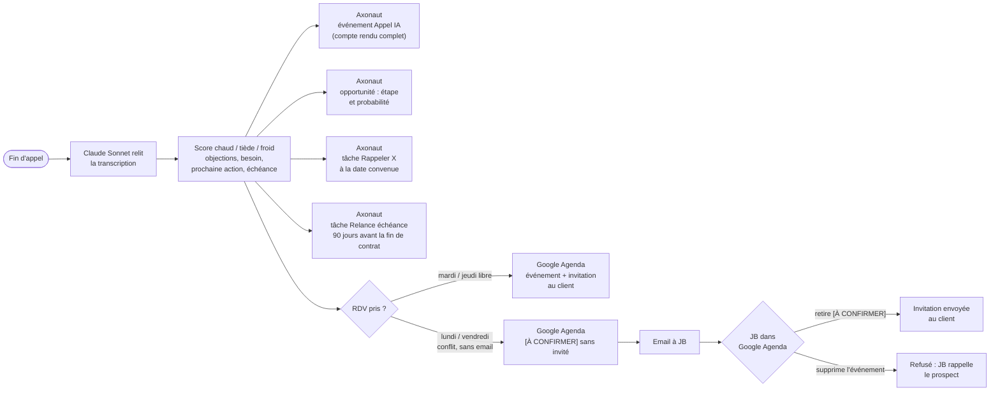
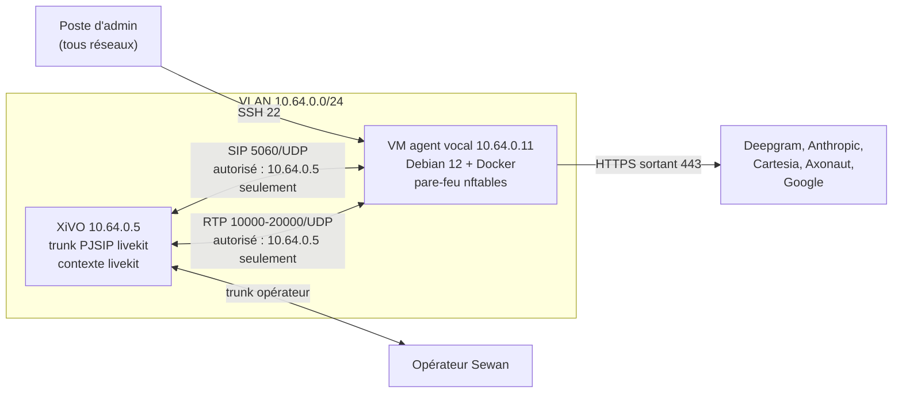

# Schémas

Ces schémas sont écrits en **Mermaid** : GitHub et GitLab les affichent directement, et on les modifie comme du texte. Chacun s'ouvre aussi dans **draw.io** (lien sous le schéma), pour l'éditer à la souris ou l'exporter en PNG ou PDF.

1. [Vue d'ensemble](#1-vue-densemble) : qui parle à qui.
2. [Déroulé d'un appel](#2-déroulé-dun-appel) : de la planification à la mise à jour d'Axonaut.
3. [Conversation](#3-conversation) : ce que fait l'agent selon les réponses.
4. [Après l'appel](#4-après-lappel) : score, Axonaut, Google Agenda et confirmation des RDV.
5. [Réseau et ports](#5-réseau-et-ports) : flux à ouvrir entre la VM et le XiVO.

---

## 1. Vue d'ensemble

**À retenir**
- Le **XiVO garde la main** sur la téléphonie : sortie opérateur, numéro présenté, enregistrement. Pour lui, l'agent est un simple client SIP.
- Sur la VM, **LiveKit** transporte l'audio. Le **worker** est le cerveau en temps réel : il écoute avec Deepgram, réfléchit avec Claude Haiku et parle avec Cartesia.
- L'**orchestrateur** fait tout ce qui n'est pas en temps réel : choisir qui appeler et quand, analyser l'appel avec Claude Sonnet, puis écrire dans Axonaut et Google Agenda.

[Ouvrir dans draw.io](https://app.diagrams.net/?pv=0&grid=0#create=%7B%22type%22%3A%22mermaid%22%2C%22compressed%22%3Atrue%2C%22data%22%3A%22hVbbctowEP0aT5IHMo4pafNo7IQwoYUCkzB9E7IADbakkW1C%2F76ri43siGkGsC6rs9rds8fZ5fwTH5CsgiicLYMwhid8ynq7l0gcYLh%2BngWjcRBF6yAZBvFTbh7iwBklsE%2FOtKwQq2AcBaO0hTCfhTm7kLwUBFfBMNnKIHoJhs%2FqUIZkFkQJ2E3T58SMMirBkNTSize3gHNhriGRNr3ArsgnYt6jG3NyQ9%2FnMHsI7x%2B%2F3Yf3I%2BdsJWt2hL2cnsiRupfFHAI8qxg9m1Jf5cc%2BJ6W6%2Fw0SguRqWHKpMlM6toRJsoeESVIQVvXuSVjmq8D7T3NzeEYh2utz4YljlDtxPDzA5Dbl%2BEjknTf%2B1dTmzkYwKKlwEwfbUTgKH435C%2Fwu1wvtAf4Gkfr14s7eerBEnohbEnUznRNlP0wVJHwl54UXbwlwt7AjSUYhi9HdV5MP41HnYvDJ5bHjD2FcE6q8iZrqkhiuYJpdpZUB5BIfCBQHVVx2ql8UQFZVfXRycyZyxOiOYkNCTV%2FBy2pgo%2FU4Ssc2utXvGQU%2BOVi2RUqD05Ao6fATsRJLKirK2ZfUXGHPNDaxraAsFGuKTpXVbbyY%2BomSTsyJlBABKIVzA5tIXl9p91fLhSRHtc7XK6LHuttIQI4SqQi8CMnaIoAmkZIi5%2ByJ07Of2b96XlecMeK2KGIo%2F1tquVLNU2Iu%2BwFcSd94%2BscqTl1R3dVzURE%2Bo0opPHeJrczEZ85QXV0vMBcC5KFmICU6qf1a69VI8dHrZ2LLOuEchEc5hmbI3HRho0tPjKD6rIVrK4l1vkzf%2FahWaiYFgga6YGn7UOMpM6jijsqC9JvJzeFCd3syGCjaaOHuzDet4cbd%2BJ4oqmopCqKx6oM6o1y5UTtaw5pz1uoCuexOQZcaUxj2fXRxP1rTD%2Fg2CNAIvuXXN%2B8yMLdZnrfL2heoBNavjptWGLTXmQ9In9hRFrSvktYexMP14MTa22mWoTGa5XjT9eCw8VJX7c5UVTucX4sIFFHot6GEkteGU4ZtFRLEzGUjYRYsvpR8EnfhQOgF%2FDuxpbnTDf%2B7g%2BWwNgJAX%2FxA5zD%2BBw%3D%3D%22%2C%22effect%22%3A%22pop%22%7D)

---

## 2. Déroulé d'un appel

**Où regarder en cas de problème**
- Étapes 1 à 3 : `docker compose logs orchestrator`.
- Étapes 4 à 6 : `docker compose logs agent-worker sip`.
- Étapes 6 à 8 : `sngrep` sur le XiVO.
- Étapes 9 à 16 : la transcription `data/transcripts/<call_id>.json`.
- Étapes 17 à 19 : `avp calls show <call_id>`.

[Ouvrir dans draw.io](https://app.diagrams.net/?pv=0&grid=0#create=%7B%22type%22%3A%22mermaid%22%2C%22compressed%22%3Atrue%2C%22data%22%3A%22dVXbUtswEP2aTOEBxiXttH00gWEoKQmESfKq2EqyYGtVXVz6993VJRfczHhsS97L2bNHayt%2Fe6kqeQNiY0Q7KMrBVUGX8A6Vb1fS7La0MA4q0EI5Wk3YyPKLqbbSOiOc9IbWZ6LT5yec7srsdYe4aSS9lBupanHCfvyQ7cfQyQdwJ%2BwW2Yyj8UaHlWgYzB80b9KcwrPMfkuYT07YTLPN1KDVstpjmFwMhrd0UVXDMmA0XFEj2boGq1HBChpCPRoOyh9hlw1%2BXvdCTGKE0RbBArPoFQPJGcmRY1xfc0m6ERtOMaLFOoY2sEvBu6g1WnCA6ryXiSiNqUx0kZytEXQziC09JKdLHzsJTRMtPolE7dkaqOEhKMOpkqmSwr%2Fv040fUr5FTPeIvpPcEaE1PbPZ4iMqbAl6zMg5SIKpQmQS%2FCEpvVTLGOP%2BcX7%2FchsBDoeXl5cM2hmv3jgq6egN3B7oMjlPo3MZ4F0VFo2L%2Fe9AhPpRJyQ7oR%2BD04kIyzSFN9osvtLt%2Bze6ff6Sl0Wxzz69OMZ%2BEz0rg8zxHuMxmaWvAXscLo5COKKIBLDvJamxTsC3vhWgolZaaS211oCM69n8%2FrwXOpOjFNKsYI7LnQCkMnIDNABkGwQyCjJvhQpaDy2rU1UQAPRqT8BnRHgtTM1cerAn%2FT6AevI0fajSrP3Va6w8rY%2F0GQSwMnR6ToGIJ9DlE3jonUpDpWQQCH%2BnOqGv5oTsOcEXGpxvhIN1Pl4crDCyQ%2BiXlY%2FCs6iiDPomaVq8GKFsZUCnRsd%2BpPYLl8cNHd0k6rPZ0xic7A%2BFSe6vaP5a9hk1wgfnGZcbjr2t0Mj%2Fc5zq3ManIIn0U%2BQheTx3OMXzzZzjg%2BqAUMdS0OewHKNCtQbTHs7xD8h%2FQYC983jFoPTyHRX9yTh8RZPFyUC7qv0hbid0qssEoixn%2BQc%3D%22%2C%22effect%22%3A%22pop%22%7D)

---

## 3. Conversation

**À retenir**
- Deux agents se passent la main. L'**accueil** franchit le standard. Le **décideur** qualifie et prend le RDV.
- Les textes de chaque agent sont dans `prompts/accueil.md` et `prompts/decideur.md`. Les questions et les objections sont dans `campaigns/ehpad.yaml`.
- L'annonce « intelligence artificielle, appel enregistré » est fixe, et une campagne ne peut pas la modifier.

[Ouvrir dans draw.io](https://app.diagrams.net/?pv=0&grid=0#create=%7B%22type%22%3A%22mermaid%22%2C%22compressed%22%3Atrue%2C%22data%22%3A%22nVXRjtMwEPwai7uHSiFRVfGYNu216EDihHh3nW1rSOxgx4H7e3btNHECLQKpUhtnvTOzs7tdLBYsyYVWJ3lmWY6%2FWZrgp%2BKv2rV0kiZQfcPzhY88VfqHuHDT4vnnYgjPH9hyzdL0GfChMdo2ICikZJuM5e%2BE0eKCr1K2LB7xGFNlW%2FxesxXdKkJUi3ekVizbHA1LdxhiwotGqxKcofurEXM9JFpt8FUN1vIzGOlx6ChZvw2sXrjoGYypH7TDiP4S%2FhLamfYxClDadVCRfAyRJKtyFr9absqg5BYTC6bzdJNOC16NdNLbdP4f7eJqLtUAsgkY%2BRkUGYBQDmQVIXGltBIk%2BRASUj5QBs7StgZqujdGl1BzLD51BER%2ByqsfEa9NZGwRjH0Z%2FLOx2JJKb1tM3KuLXC2m6vjReiG9uqJ39KNuiY5D3YnhTQMThR0IPFe6JmVUhVrXfZblTSQDJ2e9Rt%2FD3KKNI25vXU7MDXRamghQWuvo0pEb47vpHo6C0V3PPIbJ%2BjFCKzyVN7pptJWzsYCfAqliArrDI0p3gWfeoefkqjyrcWC20%2BaZ3hjxm34uyRruuQUm17bGpz91UEpOSOVaoj5huo1aZxc4fHJgKbW9OvLd8UqepOCzYrhQUG58P8yLv4syP4WmPKA2Tz%2BoyEkpy3azPnyaFk87OVRpH%2FJ8wOalSfWL5Cs4fBhZ4UbtZKji77n3d3JfV1bxxS8l3MumDnTjhsPk18qjj51%2BDSFz9TMgpcc9se87%2BtmpUUUHqjQwEWK179TBcVxtV0fer%2B%2FDcSecikf3Rm1nq%2B4v0bGIQ18s8P83w5byoxwvhJsjsmX%2FMptJ%2Fgs%3D%22%2C%22effect%22%3A%22pop%22%7D)

---

## 4. Après l'appel

**À retenir**
- Rien n'est écrit dans l'agenda Axonaut : le RDV y arrive par la synchronisation avec Google Agenda.
- La relance d'échéance est créée **même si le prospect refuse aujourd'hui**, dès qu'il cite une date de fin de contrat ou de décision.

[Ouvrir dans draw.io](https://app.diagrams.net/?pv=0&grid=0#create=%7B%22type%22%3A%22mermaid%22%2C%22compressed%22%3Atrue%2C%22data%22%3A%22jVRha9swEP01ou2HguespP3ouElJWDZwYfSrbF8aBUUyspRt%2F353p9R2TJIWDELy3b1375600fZPtZXOizT5UYgkwxW%2F7FY8zESaLpTBXX0jmwY07sXD8x0e3N%2BLyRzXWYzKtQw14P7VGgNUyoFWXkzy0ol0gbFa4qF30rSVU41X1sRiHeBsUDWPVV8r66go0gs1Ry2oiBL5RGSPjBePNs6qegBmyx1UhNGKNMf%2FJbSW%2BsgHMY2zWFcZqiKrSIhiufhTtY2rNBWMiOYDotnbt0g1%2B2uNDMOGY%2F4hLgb2YEiWLMqYLLNB6G1l940HVs3UgTrGAw3%2B7ip0egnaNo11PhgcAKNT8iTrevOygUE0jwvVKGWpdJ9yBXhyCTgmp9WWeinYMoC%2FkrexLlSTHVFL7ruy5gAmXJf6%2B9dgQcehnZtkn%2FNE9Xc2uJbmf5A8Haa0iY4%2F0kLL%2BiusCjElTsXzbxZRtaz1gjKmfUbRZUwxOd1LV6vOvDsIvNOqdCwAxSQvR2O9WPuuiUv2jt6QnxpMpHSRlDkoL9nUfYJkZ2nFgScdjfjpYAb8cDC1AzzoK6EuG7IKX5hW0jVLYC%2BV7umnn9LH%2F0j9kRX99XOxLNbzgkh1FbmJs3bE6v0I1hFpHvGTzl%2Br2ShrPUhaxblRDHoQ4XpiY8qno1ydSuXAK36jLrfzocjx1iz70aBo5mD%2FxRbhS5MawbehQdPtiYC%2BOWuID%2FTj5SlgE9rRq8AiOL6tesiCRcCHoW3wMe14%2FAc%3D%22%2C%22effect%22%3A%22pop%22%7D)

---

## 5. Réseau et ports

**À retenir**
- Seul le XiVO peut joindre la VM en SIP et en RTP (règle nftables générée par `deploy/render-config.sh`).
- La VM n'a besoin que de HTTPS sortant vers les API. Aucun port n'est à ouvrir depuis Internet.

[Ouvrir dans draw.io](https://app.diagrams.net/?pv=0&grid=0#create=%7B%22type%22%3A%22mermaid%22%2C%22compressed%22%3Atrue%2C%22data%22%3A%22vVNRb4IwEP41zbYHTC3oskcGc7roJOKMrwVPJWJLSlF%2F%2Fq5FEZ3PIw09vrv7rndfWefymG650oTR8YxQH3dcfjghvXfCWCRLDQisnvhqnwniBokibEDcj2ctqxI9igQu8d9K4NXpBTNIL0TUcTCEvAYIxPEQAXTgMgBdTJo6ZZVsFC%2B2Bh3733VNazHapZ2%2B16EdjBsw78x8SazXcrSY1jnLDK1rTq91UK0qsUNf9BWPItzz7AC7TLciUik0nGyfF%2BejaovzTHBnlG9AmKEdZMrzVuVut0UcQpJxYbzMUmA2DWW6A9UKKrgCZw0V%2BsRa8ySH8q48iFVj25bRcoP2iG1jPdo3s%2FoJoxY7r7RUWVmLZBP9mzmhBlDlsLfd%2FBXoYbnZPLIc%2BDjMvP%2Bl6kVHWdS0imuoVJM%2BjWp1pnduGsPRaHAzUSthi3s4n0exOZVUmltdPc9tqP1oVHOHAAXe1z1hFhZ6q2SRpebz2nuAfxOUGT8HnaTAadyGfEq5yaE50y8%3D%22%2C%22effect%22%3A%22pop%22%7D)
